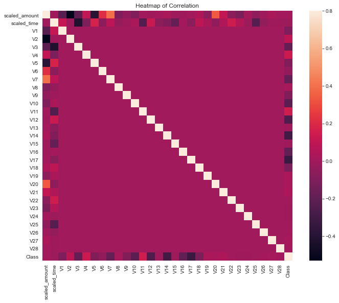

# Introduction
The objective in this project is to build machine learning models to classify or identify fraudulent card transactions from a given card transactions data, thus seeking to minimize the risk and loss of the business. The biggest challenge is to create a model that is very sensitive to fraud, since most transactions are legitimate, making detection difficult.<br>
## Data Description<br>
The features are scaled and the names of the features are not shown due to privacy reasons.Features V1, V2, ... V28 are the principal components obtained with PCA, the only features which have not been transformed with PCA are 'Time' and 'Value'. The variable 'Time' contains the seconds between each transaction and the first transaction in the data set. The 'Amount' variable refers to the amount of the transaction. Feature 'Class' is the target variable with value 1 in case of fraud and 0 otherwise.<br>

**Importing Libraries:**<br>
```ruby
import pandas as pd
import matplotlib.pyplot as plt
%matplotlib inline
from sklearn.preprocessing import StandardScaler
import seaborn as sns
import numpy as np
import warnings
warnings.filterwarnings('ignore')
```
**Load Data:**<br>
The dataset used in this project is available [here](https://www.kaggle.com/mlg-ulb/creditcardfraud/data).
```ruby
data = pd.read_csv('creditcard.csv')
data.head()
```
Inorder to check number of rows and columns in our dataset
```ruby
print(data.shape[0],data.shape[1])
```
To display the columns<br>
```ruby
print(data.shape[0],data.shape[1])
```  
```ruby
data.info()
``` 
```ruby
data.isnull().sum().max()
```
Deteremine the number of fradulent cases in dataset<br>
```ruby
print('Normal Transactions count:',data['Class'].value_counts().values[0])
print('Fraudulent Transactions count:',data['Class'].value_counts().values[1])
```
```ruby
print('Normal transactions are',(data['Class'].value_counts().values[0]/data.shape[0])*100,'% of the dataset')
print('Fraudulent transactions are',(data['Class'].value_counts().values[1]/data.shape[0])*100,'% of the dataset')
```
## Exploratory analysis<br>
### Visualization of Transaction class distribution<br>
```ruby
count_class=pd.value_counts(data['Class'],sort=True)
count_class.plot(kind='bar',rot=0)
plt.title('Transaction class distribution')
LABELS=['Normal','Fraud']
plt.xticks(range(2),LABELS)
plt.xlabel('Class')
plt.ylabel('Frequency')
```
<br>
### Visualization of Amount and Time Distribution<br>
```ruby
fig, ax = plt.subplots(1, 2, figsize=(18,4))

amount_val = data['Amount'].values
time_val = data['Time'].values

sns.distplot(amount_val, ax=ax[0], color='r')
ax[0].set_title('Distribution of Transaction Amount', fontsize=14)
ax[0].set_xlim([min(amount_val), max(amount_val)])

sns.distplot(time_val, ax=ax[1], color='b')
ax[1].set_title('Distribution of Transaction Time', fontsize=14)
ax[1].set_xlim([min(time_val), max(time_val)])
```
<br>

### Visualization of Amount and Time by class<br>
```ruby
sns.set_style("whitegrid")
sns.FacetGrid(data, hue="Class", size = 6).map(plt.scatter, "Time", "Amount").add_legend()
plt.show()
```
<br>
From the above graphs,we can conclude that the fraud transactions are evenly distributed throughout time<br>
### Get sense of the fraud and normal transaction amount<br>
```ruby
fraud=data[data['Class']==1]
normal=data[data['Class']==0]
fraud.Amount.describe()
```
```ruby
normal.Amount.describe()
```
# Normalization of data
Scaling is done to normalise the data within a particular range.<br>
Since most of our data has already been scaled we should scale the columns that are left to scale (Amount and Time).<br>
RobustScaler reduces the influence of outliers.<br>
```ruby
from sklearn.preprocessing import StandardScaler,RobustScaler

std_scaler = StandardScaler()
rob_scaler = RobustScaler()

data['scaled_amount'] = std_scaler.fit_transform(data['Amount'].values.reshape(-1,1))
data['scaled_time'] = rob_scaler.fit_transform(data['Time'].values.reshape(-1,1))

data.drop(['Time','Amount'], axis=1, inplace=True)
```
```ruby
scaled_amount = data['scaled_amount']
scaled_time = data['scaled_time']

data.drop(['scaled_amount', 'scaled_time'], axis=1, inplace=True)
data.insert(0, 'scaled_amount', scaled_amount)
data.insert(1, 'scaled_time', scaled_time)
```
Normalization is a process by which we scale values to be between specified limits, usually -1 to 1 or 0 to 1. This process is important because our machine learning models are heavily affected by differences in number size. The major difference will cause massive inaccuracies in our model. Normalization helps us to eliminate these sources of error rather than having it propagate throughout our analysis.<br>
```ruby
data = data.sample(frac=1)

# amount of fraud classes 492 rows.
fraud_df = data.loc[data['Class'] == 1]
non_fraud_df = data.loc[data['Class'] == 0][:492]
normal_distributed_df = pd.concat([fraud_df, non_fraud_df])
# Shuffle dataframe rows
new_df = normal_distributed_df.sample(frac=1, random_state=42)
new_df.head()
```
### Visualization of Transaction Class Distribution after creating the subsample<br>
```ruby
count_class=pd.value_counts(new_df['Class'],sort=True)
count_class.plot(kind='bar',rot=0)
plt.title('Equal class distribution')
LABELS=['Normal','Fraud']
plt.xticks(range(2),LABELS)
plt.xlabel('Class')
```
<br>
Correlation matrix is used to check strong corellation between different variables in our dataset which helps us to determine strong linear relationships and also tells us which features are important for overall classification.<br>
```ruby
corrmat=data.corr()
fig=plt.figure(figsize=(12,9))
sns.heatmap(corrmat,vmax=0.8,square=True)
plt.title('Heatmap of Correlation')
plt.show()
```
<br>
From the above graph,we have a lot of values very close to 0.There is no strong relationship between most of the v parameters(i.e from v1 to v28).there is variation in relationship between different parameters with the class.The lighter ones have the positive correlation whereas the darker ones have negative correlation.Thus, we can conclude that V10,V12,V14 and V17 are highly negatively correlated to class and V2,V4,V11 and V19 are highly positively correalted to class.<br>
# Data Cleansing<br>
We have identified the input features and the target variable so we will separate them into two objects ‘X’ and ‘y’ and draw the histogram of all the input features to see the data at a glance. The target variable which we would like to predict, is the 'Class' variable.<br>
### Define X and y variables<br>
```ruby
x = data.loc[:, data.columns != 'Class']
y = data.loc[:, data.columns == 'Class']
print(x.shape)
print(y.shape)
```
### Plot histograms of each parameter<br>
```ruby
x.hist(figsize = (20, 20))
plt.show()
```
<br>
## BoxPlots<br>
We will use boxplots to have a better understanding of the distribution of these features in fradulent and non fradulent transactions.<br>
### Visualization of correlations using boxplot<br>
```ruby
f,ax=plt.subplots(2,2,figsize=(24,14))
f.suptitle('Features with high negative correlation',size=20)
sns.boxplot(x='Class',y='V10',data=new_df,ax=ax[0,0])
sns.boxplot(x='Class',y='V12',data=new_df,ax=ax[0,1])
sns.boxplot(x='Class',y='V14',data=new_df,ax=ax[1,0])
sns.boxplot(x='Class',y='V17',data=new_df,ax=ax[1,1])
```
<br>
```ruby
f,ax=plt.subplots(2,2,figsize=(24,14))
f.suptitle('Features with high positive correlation',size=20)
sns.boxplot(x='Class',y='V2',data=new_df,ax=ax[0,0])
sns.boxplot(x='Class',y='V4',data=new_df,ax=ax[0,1])
sns.boxplot(x='Class',y='V11',data=new_df,ax=ax[1,0])
sns.boxplot(x='Class',y='V19',data=new_df,ax=ax[1,1])
```
<br>
Remove the extreme outliers from features that have a high correlation with our classes.<br>
```ruby
v14_fraud = new_df['V14'].loc[new_df['Class'] == 1].values
q25, q75 = np.percentile(v14_fraud, 25), np.percentile(v14_fraud, 75)
v14_iqr = q75 - q25
v14_cut_off = v14_iqr * 1.5
v14_lower, v14_upper = q25 - v14_cut_off, q75 + v14_cut_off
new_df = new_df.drop(new_df[(new_df['V14'] > v14_upper) | (new_df['V14'] < v14_lower)].index)


v12_fraud = new_df['V12'].loc[new_df['Class'] == 1].values
q25, q75 = np.percentile(v12_fraud, 25), np.percentile(v12_fraud, 75)
v12_iqr = q75 - q25

v12_cut_off = v12_iqr * 1.5
v12_lower, v12_upper = q25 - v12_cut_off, q75 + v12_cut_off
new_df = new_df.drop(new_df[(new_df['V12'] > v12_upper) | (new_df['V12'] < v12_lower)].index)


v10_fraud = new_df['V10'].loc[new_df['Class'] == 1].values
q25, q75 = np.percentile(v10_fraud, 25), np.percentile(v10_fraud, 75)
v10_iqr = q75 - q25

v10_cut_off = v10_iqr * 1.5
v10_lower, v10_upper = q25 - v10_cut_off, q75 + v10_cut_off

new_df = new_df.drop(new_df[(new_df['V10'] > v10_upper) | (new_df['V10'] < v10_lower)].index)
```
# Classifier<br>
An algorithm that maps the input data to a specific category.Classification is a type of supervised learning. The training data is used to make sure the machine recognizes patterns in the data and the test data is used only to access performance of model.<br>
```ruby
X=new_df.drop('Class',axis=1) 
y=new_df['Class']
```
```ruby
from sklearn.model_selection import train_test_split

X_train, X_test, y_train, y_test = train_test_split(X, y, test_size=0.2, random_state=42)
X_train = X_train.values
X_test = X_test.values
y_train = y_train.values
y_test = y_test.values
```
## Model Architecture

 ### Import the required classifiers
```ruby
from sklearn.tree import DecisionTreeClassifier
from sklearn.linear_model import LogisticRegression
from sklearn.svm import SVC
from sklearn.neighbors import KNeighborsClassifier
from sklearn.ensemble import RandomForestClassifier
from sklearn.model_selection import cross_val_score
from sklearn.metrics import accuracy_score
from sklearn.metrics import confusion_matrix
from sklearn.metrics import classification_report
```
#### Logistic Regression<br>
```ruby
logmodel = LogisticRegression()
logmodel.fit(X_train,y_train)
```
#### Support Vector Classifier<br>
```ruby
svc=SVC()
svc.fit(X_train,y_train)
```
#### K-nearest neighbors<br>
```ruby
knn=KNeighborsClassifier()
knn.fit(X_train,y_train)
```
#### Random Forest Classifier<br>
```ruby
RDF_Classifier=RandomForestClassifier(random_state=0)
RDF_Classifier.fit(X_train,y_train)
```
#### DecisionTreeClassifier<br>
```ruby
DecisionTreeClassifier= DecisionTreeClassifier()
DecisionTreeClassifier.fit(X_train,y_train)
```
### Model Evaluation and Prediction<br>
 ```ruby
models_list=[('Logistic Regression',logmodel),('SVC',svc),('KNeighborsClassifier',knn),('RFC',RDF_Classifier),('DecisionTreeClassifier',DecisionTreeClassifier)]
models=[j for j in models_list]
print()
#print('===========================Model Evaluation Results================================')
for i,v in models:
      print('==========================={}=========================================='.format(i))
      a=cross_val_score(v, X_train, y_train, cv=5)
      print('Cross validation score=',a.mean())
```
### Test Models
```ruby
models_list=[('Logistic Regression',logmodel),('SVC',svc),('KNeighborsClassifier',knn),('RFC',RDF_Classifier),('DecisionTreeClassifier',DecisionTreeClassifier)]
models=[j for j in models_list]
print()
print('===========================Model Test Results================================')
for i,v in models:
      print('==========================={}=========================================='.format(i))
      pred_test = v.predict(X_test)
      print('Accuracy =',accuracy_score(y_test,pred_test))
      print('Confusion Matrix')
      print(confusion_matrix(y_test,pred_test))
      print('Classification Report')
      print(classification_report(y_test,pred_test))
```
